# Build Guide

This is the build guide for [the sephirette](https://www.smoresboards.com/product/sephirette).

## Parts

### Required

| Name | Count | Remarks |
|:-|:-|:-|
| PCB | 2 | |
| ProMicro | 2 | |
| 12-Pin socket | 4 | |
| Reset switch | 2 | |
| Key switches | 34 | |
| Keycaps | 34 | |

#### wired build

| Name | Count | Remarks |
|:-|:-|:-|
| TRRS jack | 2 | |
| TRRS (4 poles) cable | 1 | |
| Micro USB/USB-C cable | 1 | according to the selected ProMicro MCU |

#### wireless build

| Name | Count | Remarks |
|:-|:-|:-|
| Power switch | 2 | |
| battery | 1 | |

### Optional

| Name | Count | Remarks |
|:-|:-|:-|
| Hot-swap sockets | 34 | |
| Top plate | 2 | |
| Bottom plate | 2 | |
| Standoff | 20 | |
| Screw M2 long | 10 | |
| Screw M2 short | 10 | |
| Washer | 10 | |
| Bumpons | 8 | |

## Assembly

If you are going to use hot-swap sockets solder them on the **bottom** side first.
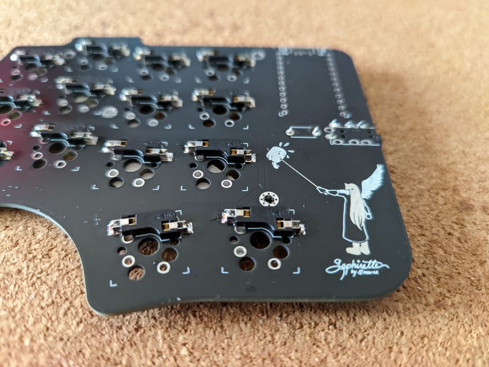

Solder reset switch and trrs jack on the **top**.
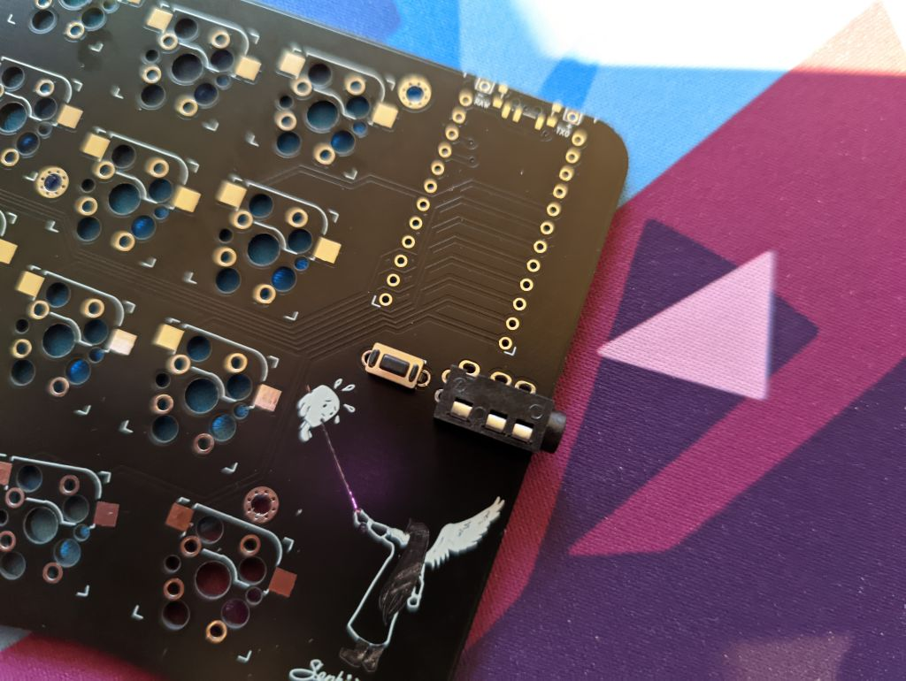

Solder ProMicro using the 12-pin sockets on the **top** side of the PCB.
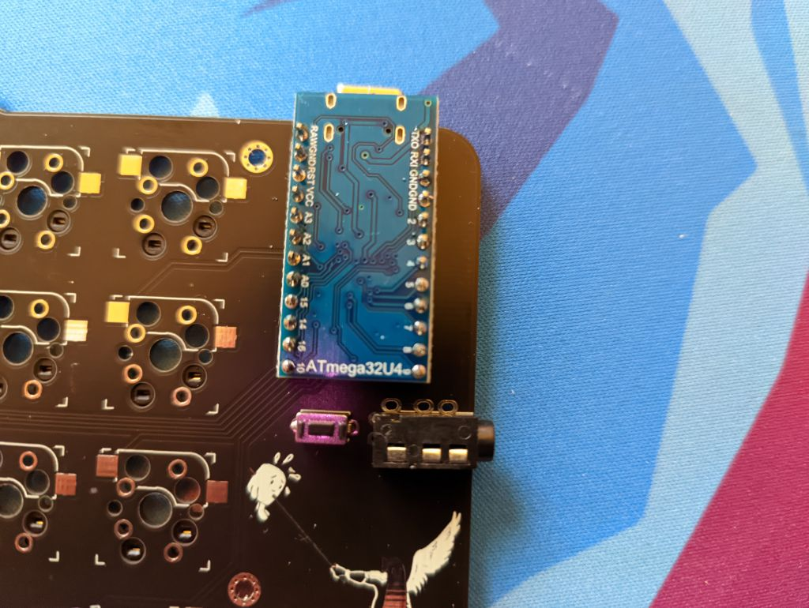

**NOTE:** Make sure to properly align your ProMicro MCU pins with the text on the PCB. The MCUs won't face the same direction on both sides!
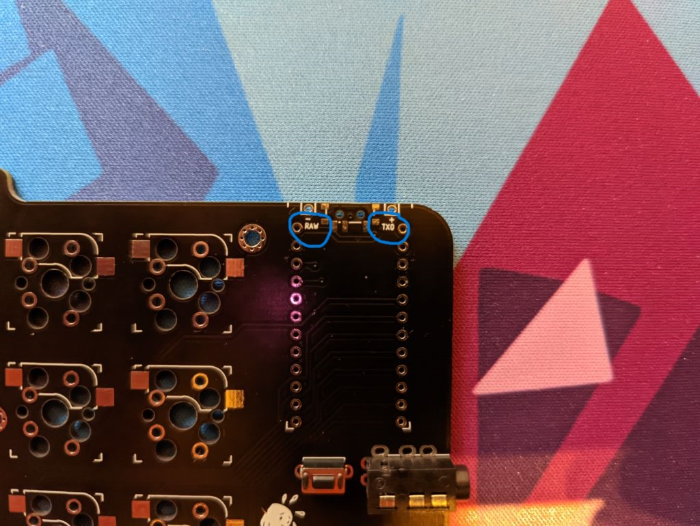
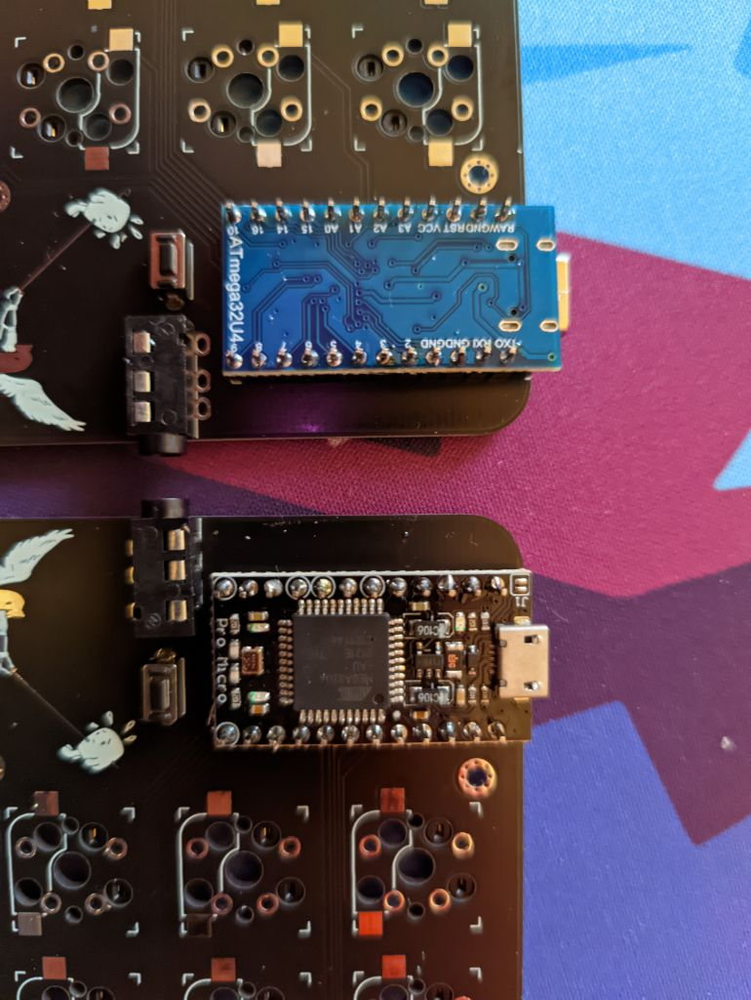

If you are going to use a top plate, then screw the long screws in with the standoffs on the bottom.
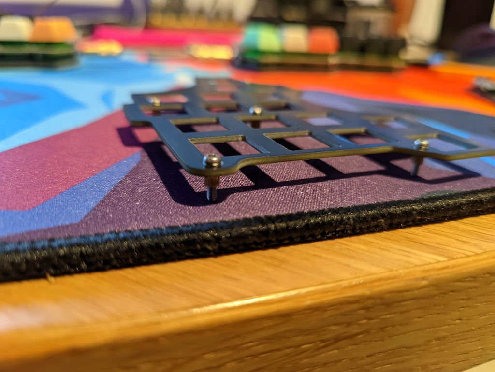

Insert 4 switches in the corners and don't forget to properly align them with the hot-swap sockets (if you are using any).
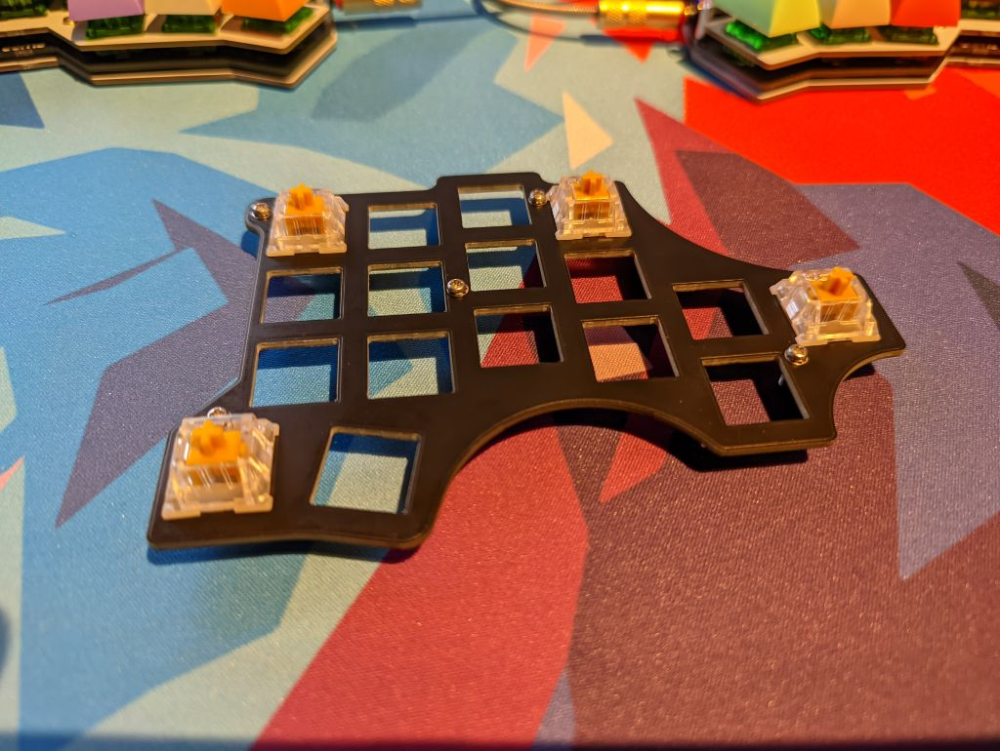

Place the washers on to the PCB.
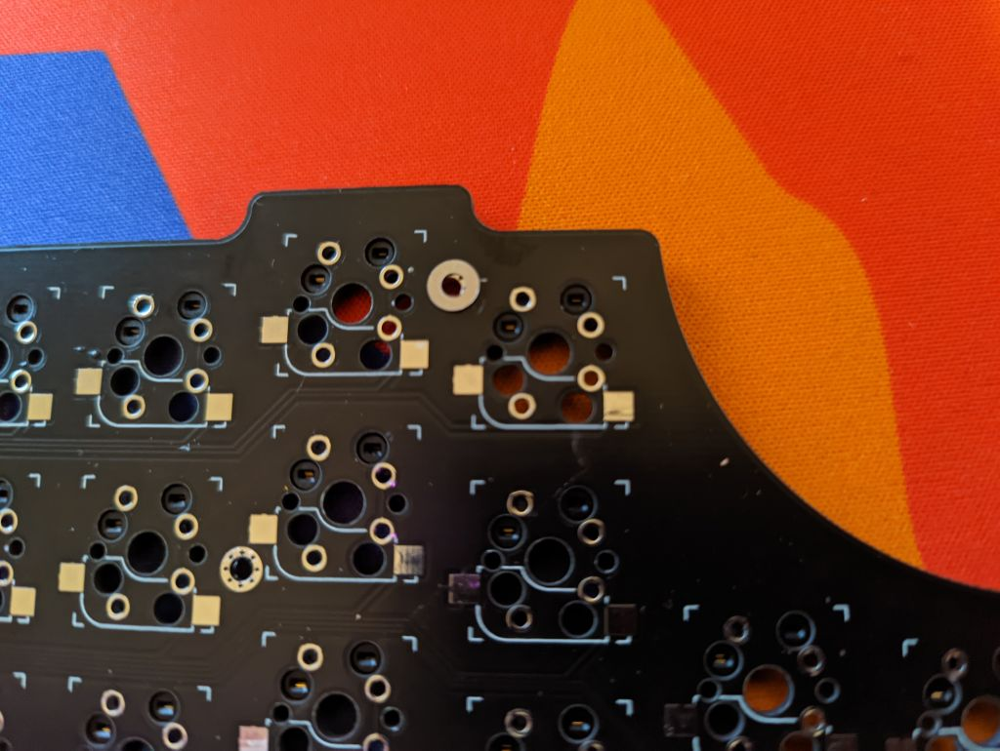

Align the the screws looking out from the top-plate with the washers on the PCB and gently press the 4 switches into place. After that you can add the remaining switches.

On the backside of the PCB screw in the standoffs.
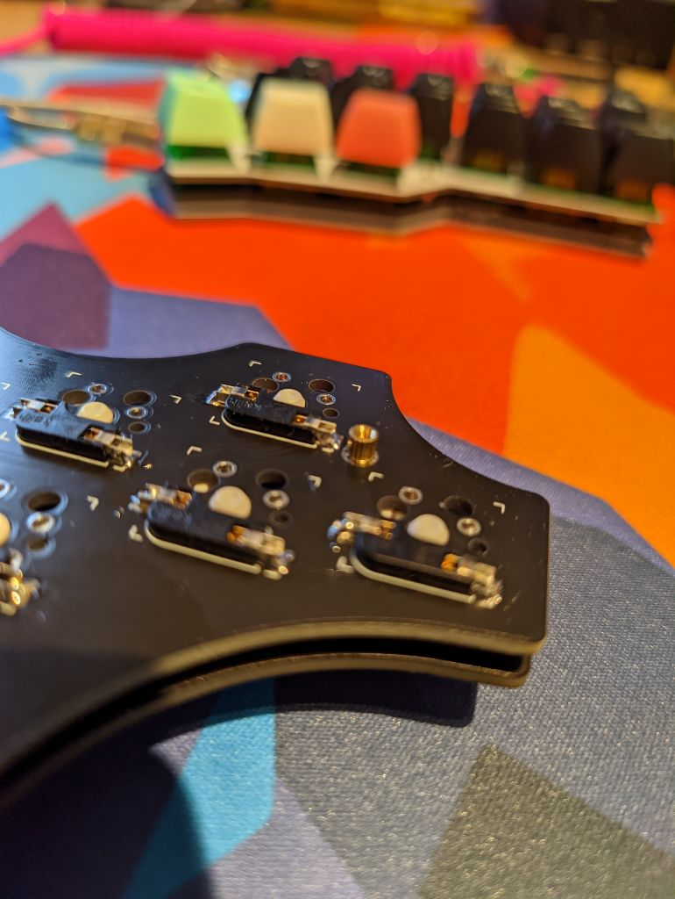

Put the bottom plate on the standoffs and screw in the short screws and add the bumpons.
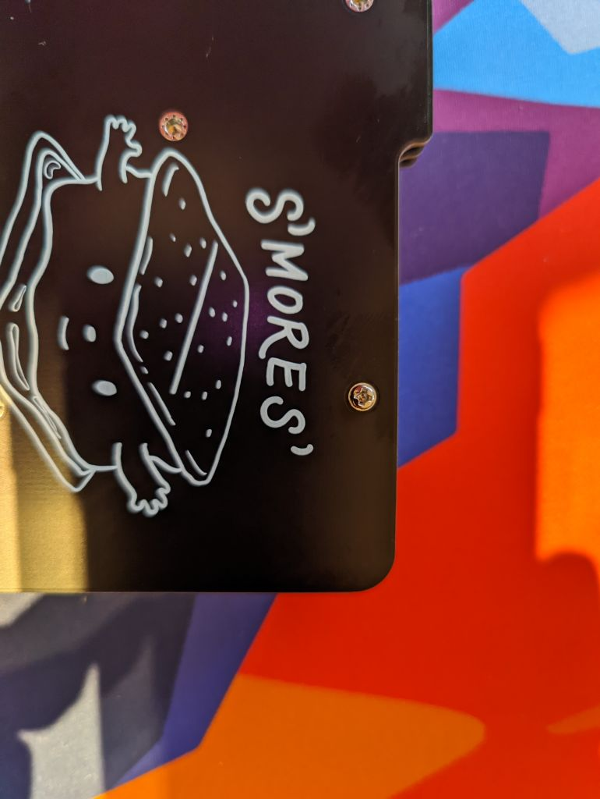

Add some keycaps and you're good to go.
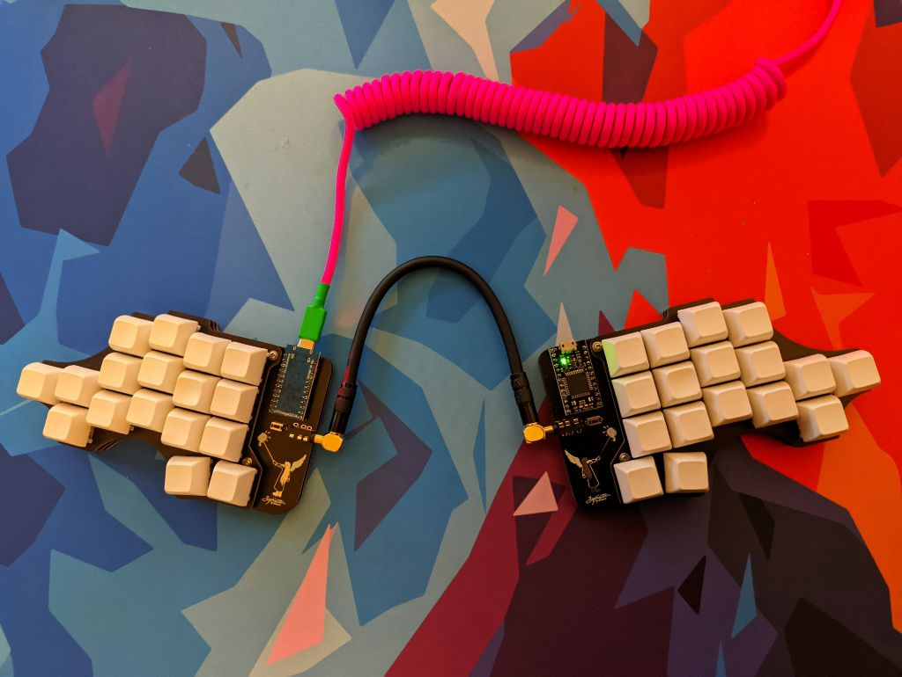

## Firmware

You can use the [QMK-config](https://github.com/smores56/qmk_firmware/tree/master/keyboards/clog) of the clog or ZMK config in the main repo of [ZMK](https://zmk.dev/). (This board uses the Clog firmwware and will be named as such on your computer.)

If you want to use the default keymap, you can just grab [this firmware](assets/clog_default.hex) and flash it right away.

